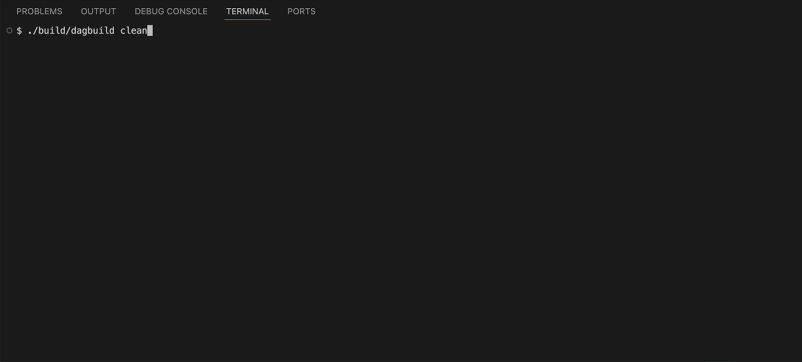

# DAGBuild

DAGBuild is a minimal build automation tool written in C++20.

## Demo

<p align="center">
  
</p>

## Project Purpose

DAGBuild reads a configuration file, determines which source files need to be
compiled, invokes the C++ compiler, and links the resulting object files into
an executable.

The project demonstrates how build systems work internally. It covers file
timestamps, incremental compilation, dependency graphs, parallel execution,
and separate debug and release builds.

## Problem Being Solved

Compiling a C++ project manually becomes difficult as the number of source
files grows. A developer would need to run separate compiler commands for many
files, link the generated object files in the correct order, and repeat these
steps after every change.

DAGBuild automates this process. It recompiles only modified source files,
builds targets in dependency order, compiles independent files concurrently,
and keeps debug and release artifacts separate.

## Features

- Reads build targets from `dagbuild.conf`.
- Supports `build`, `clean`, `list`, and `help` commands.
- Compiles C++ source files and links object files into executables.
- Recompiles only source files affected by newer source or header files.
- Builds target dependencies in topological order.
- Detects unknown dependencies and dependency cycles.
- Compiles independent source files in parallel with `--jobs`.
- Provides debug and release modes with mode-specific compiler flags.
- Stores debug and release object files and executables separately.
- Reports configuration, compilation, linking, and filesystem errors.
- Includes unit tests for configuration parsing and dependency graph logic.

## Architecture

DAGBuild separates configuration parsing, dependency analysis, and build
execution into independent components. The main execution flow is:

```text
Command-line arguments
        |
        v
      main.cpp
        |
        v
   ConfigParser
        |
        v
unordered_map<string, BuildTarget>
        |
        v
  DependencyGraph
        |
        v
Topological build order
        |
        v
      Builder
        |
        v
Compiler -> object files -> linker -> executable
```

### Components

- **`main.cpp`** parses commands and options, selects the requested target,
  build mode, and number of compilation workers, and coordinates the complete
  build process.
- **`ConfigParser`** reads `dagbuild.conf`, validates its contents, and creates
  a map of target names to `BuildTarget` objects.
- **`BuildTarget`** stores the configuration of one target, including its
  source files, header files, dependencies, object directory, and output path.
- **`DependencyGraph`** uses depth-first search to detect dependency cycles and
  produce a topological build order in which dependencies appear before the
  targets that require them.
- **`Builder`** prepares output directories, validates source files, checks file
  timestamps, creates compilation tasks, runs them in parallel, and invokes the
  linker after compilation finishes.
- **`BuildMode`** represents debug and release builds and determines the
  compiler flags and artifact directories used by the builder.
- **The compiler and linker** are external tools invoked by DAGBuild. The
  compiler transforms source files into object files, while the linker combines
  those object files into an executable.

## Configuration Format

DAGBuild reads its configuration from `dagbuild.conf` in the current working
directory. A target starts with `target <name>` and ends with `end`.

```text
target hello
sources examples/hello/main.cpp examples/hello/Greeter.cpp
headers examples/hello/Greeter.hpp
objects .dagbuild/objects/hello
output .dagbuild/hello
end
```

Supported keywords:

| Keyword | Required | Description |
| --- | --- | --- |
| `target` | Yes | Starts a target and defines its unique name. |
| `sources` | Yes | Lists the C++ source files compiled for the target. |
| `headers` | No | Lists headers whose timestamps can trigger recompilation. |
| `depends` | No | Lists other targets that must be built first. |
| `objects` | Yes | Defines the base directory for generated object files. |
| `output` | Yes | Defines the base output path and executable name. |
| `end` | Yes | Finishes the current target definition. |

Blank lines and lines beginning with `#` are ignored. Paths are interpreted
relative to the directory from which DAGBuild is executed.

When a build mode is selected, DAGBuild extends the configured paths. For
example, the `hello` target produces:

```text
.dagbuild/objects/hello/debug/main.o
.dagbuild/objects/hello/release/main.o
.dagbuild/debug/hello
.dagbuild/release/hello
```

## Build Instructions

Requirements:

- CMake 3.20 or newer.
- A C++20-compatible compiler available through the `c++` command.
- Git and an internet connection during the first CMake configuration, because
  GoogleTest is downloaded with `FetchContent`.

Configure and build DAGBuild:

```bash
cmake -S . -B build
cmake --build build
```

Run the test suite:

```bash
ctest --test-dir build --output-on-failure
```

## CLI Usage

```text
./build/dagbuild build <target>
./build/dagbuild build <target> --jobs <number>
./build/dagbuild build <target> --mode <debug|release>
./build/dagbuild build <target> --jobs <number> --mode <debug|release>
./build/dagbuild clean
./build/dagbuild list
./build/dagbuild help
```

Examples:

```bash
# Build hello in debug mode with one worker by default
./build/dagbuild build hello

# Build with four compilation workers
./build/dagbuild build hello --jobs 4

# Create an optimized release build
./build/dagbuild build hello --mode release

# Combine parallel compilation and release mode
./build/dagbuild build hello --jobs 4 --mode release

# Run the generated executable
./.dagbuild/release/hello

# Show configured targets or remove generated artifacts
./build/dagbuild list
./build/dagbuild clean
```

Debug mode is used by default. The accepted job count is between 1 and 10.

## Incremental Builds

Each source file is compiled into a corresponding object file:

```text
main.cpp -> main.o
Greeter.cpp -> Greeter.o
```

Before compiling a source file, DAGBuild compares filesystem modification
times. Compilation is required when:

- the object file does not exist;
- the source file is newer than its object file; or
- a configured header is newer than the object file.

After compilation, linking is required when the executable does not exist or
at least one object file is newer than the executable. If every artifact is up
to date, DAGBuild reports `Nothing to build.`

## Dependency Graph

Targets can declare dependencies with the `depends` keyword:

```text
target generator
sources tools/generator.cpp
objects .dagbuild/objects/generator
output .dagbuild/generator
end

target app
sources app/main.cpp
depends generator
objects .dagbuild/objects/app
output .dagbuild/app
end
```

DAGBuild stores targets in an `std::unordered_map` and treats their dependency
relationships as a directed graph. A depth-first search assigns visit states to
targets, detects cycles, and creates a topological build order. In the example
above, `generator` is built before `app`.

If a dependency is missing or a cycle is detected, the build stops with an
error. A shared dependency is added to the build order only once.

## Parallel Compilation

The `--jobs` option controls how many worker threads may compile source files
concurrently:

```bash
./build/dagbuild build hello --jobs 4
```

Source/object path pairs are stored as compilation tasks in a shared queue.
Workers use a mutex when taking tasks from the queue and compile files after
releasing the lock. An atomic failure flag stops workers from taking new tasks
after a compilation error. DAGBuild calls `join()` on every worker and starts
the linker only after all workers have finished.

Parallelism is applied to source files within the current target. Targets are
built sequentially according to their dependency order.

## Example Output

The order of compilation messages may differ because source files can compile
concurrently.

```text
$ ./build/dagbuild build hello --jobs 2 --mode release
Build mode: release
Preparing build directory...
Created: .dagbuild/objects/hello/release
Build directory is ready.
Preparing build directory...
Created: .dagbuild/release
Build directory is ready.
Building target: hello
Source: examples/hello/main.cpp
Object: .dagbuild/objects/hello/release/main.o
Source: examples/hello/Greeter.cpp
Object: .dagbuild/objects/hello/release/Greeter.o
Build plan created successfully.
Compiling main.cpp...
Compiling Greeter.cpp...
Compilation completed successfully.
Compilation completed successfully.
Link command: c++ ".dagbuild/objects/hello/release/main.o" ".dagbuild/objects/hello/release/Greeter.o" -o ".dagbuild/release/hello"
Build completed successfully.
```

## Known Limitations

- DAGBuild currently invokes the compiler through `std::system()` and expects a
  Unix-like `c++` command.
- The configuration format does not support quoted paths containing spaces.
- Header dependencies must be listed manually; included headers are not
  discovered automatically.
- Incremental builds use modification timestamps rather than content hashes.
- Target dependencies control build order, but their artifacts are not linked
  automatically into dependent targets. Static library targets are not yet
  supported.
- Every configured target is currently linked as an executable.
- Parallel compiler output is not synchronized and may appear interleaved.
- The test suite focuses on configuration parsing and dependency graph logic;
  CLI and full build integration tests are not yet included.
